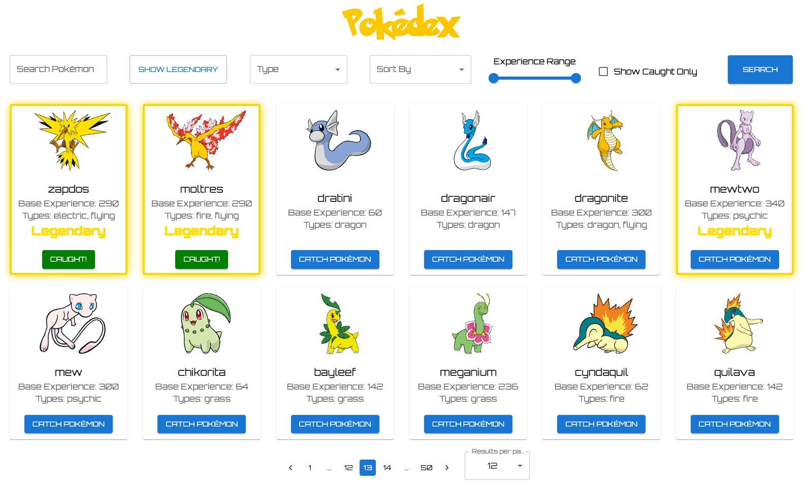

# Pokedex

Welcome to the Pokedex!



## Technologies Used

- **Frontend**: React, TypeScript, Axios, Material-UI (MUI)
- **Backend**: Node.js, Express, TypeScript, Redis
- **API**: Pokémon API
- **Database**: Redis (for caching Pokemon data and managing caught Pokemon status)

## Setup Instructions

### Prerequisites

- **Node.js**: Version 18 or higher
- **Redis**: Ensure Redis is installed and running on your local machine.

### Installation

1. **Clone the repository:**

   ```bash
   git clone https://github.com/eilonv3/pokedex-app.git

2. Navigate to the project directory:

   ```bash
   git clone https://github.com/your-username/pokedex.git
   
3. Install dependencies for both client and server:
   ```bash
    cd client
    yarn install

    cd ../server
    yarn install

4. Ensure Redis is running:
    ```bash
    redis-server

## Running the Application
1. Navigate to the server directory:
   ```bash
   cd server
2. start it:
   ```bash
   yarn start
3. Navigate to client:
   ```bash
   cd ../client
4. start it:
      ```bash
   yarn dev

#### The application will be available at http://localhost:5173/

## Features:
* View Pokemons: Fetch and view Pokemons with various filters (e.g. name, experience and type).
* View detailed information about individual Pokemon.
* Catch Pokemon: Mark Pokemon as caught
* Apply filters and sorting options to customize your search
* Identify legendary Pokemons: Filter and display only legendary Pokemons
* Identify caught Pokemons: Display only those that were caught by the user.
* Pagination: Navigate through large lists of Pokemons with pagination controls.
* API Integration: Fetch data from the Pokémon API and cache it using Redis for improved performance.

## Approach and Assumptions

### Approach:
* The Pokedex app was built with a strong emphasis on modularity and performance. 
* The backend leverages Redis for caching to reduce API calls and enhance response times.
* On the frontend, the app delivers a seamless user experience with features like dynamic filtering, sorting, and pagination.

### Assumptions:
- **Data Consistency**: It is assumed that the data retrieved from the Pokemon API is accurate and regularly updated.
    Given that new Pokemon are not frequently added, caching via Redis is expected to be effective over long periods.
- **Redis Availability**: The availability and proper configuration of Redis are assumed for caching purposes, ensuring smooth operation and performance.